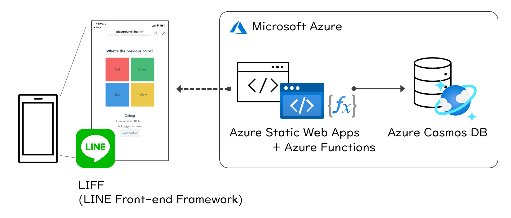

# Azure Static Web Apps と Cosmos DB で作る LIFF アプリ

このハンズオンコンテンツでは、LIFF (LINE Front-end Framework) を Azure Static Web Apps と Cosmos DB を用いてホストするサンプルをご紹介します。

ここでは、Azure を中心に解説します。LIFF の詳細に関しては、公式ドキュメントをご参照ください。

- [LINE Front-end Framework | LINE Developers](https://developers.line.biz/ja/docs/liff/overview/)

## 構成

Azure Static Web Apps でLIFFで構成した静的サイトをホストし、データは Azure Cosmos DB に蓄積します。 Azure Cosmos DB とのやりとりは、Azure Static Web Apps に統合された FaaS 機能を利用し、API を実装しています。

| 利用する Azure サービス | 概要 | 低価格に抑えるための料金の目安 |
|----|----|----|
| Azure Static Web Apps | 静的サイトをホストできる PaaS（プレビュー） | プレビューの間無料（GA後は未発表） |
| Azure Functions | イベント駆動のサーバレス コンピューティング、いわゆる FaaS （※ このハンズオンでは Azure Static Web Apps に統合されている） | 従量課金の場合、最初の 100 万回は無料/月。詳細後述。 |
| Azure Cosmos DB | NoSQL データベース | Free tier あり（最初の 400 RU/秒と 5 GB のストレージが無料）詳細後述。 |

### Azure Static Web Apps

TODO: 解説

- [価格 - Static Web Apps | Microsoft Azure](https://azure.microsoft.com/ja-jp/pricing/details/app-service/static/)

### Azure Functions

TODO: 解説

- [価格 - Functions | Microsoft Azure](https://azure.microsoft.com/ja-jp/pricing/details/functions/)

### Azure Cosmos DB

TODO: 解説

- [Azure Cosmos DB の Free レベル - Azure Cosmos DB での開発とテストのための最適化 | Microsoft Docs](https://docs.microsoft.com/ja-jp/azure/cosmos-db/optimize-dev-test#azure-cosmos-db-free-tier)
- [価格 - Azure Cosmos DB | Microsoft Azure](https://azure.microsoft.com/ja-jp/pricing/details/cosmos-db/)

## セルフペースドハンズオン

ご自身のペースでトライするには、[セルフペースドハンズオン](./docs/self-paced-handson.md)の資料をご利用ください。

## 

